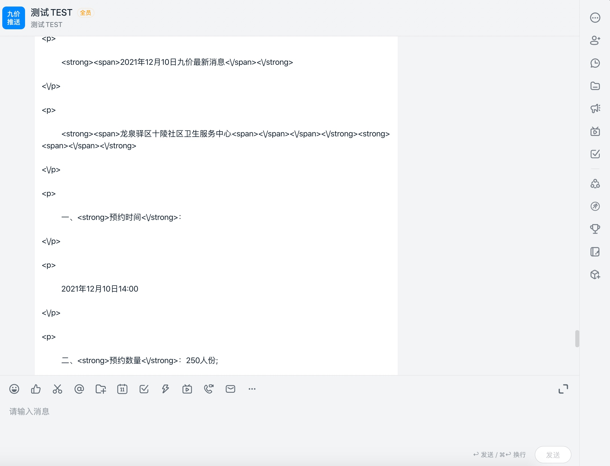
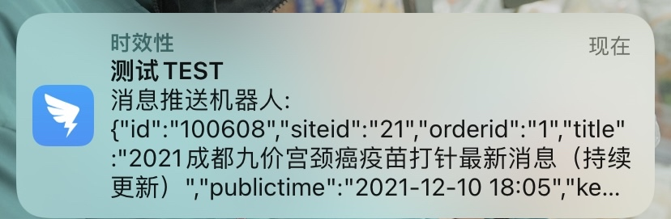
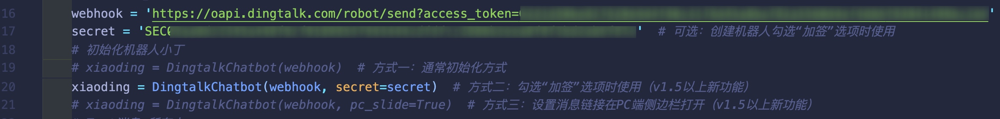

# 9jiainfo, 钉钉群聊机器人推送九价实时信息

>目前的不足：还需要使用正则来处理一下推送的消息内容

## 效果

电脑端

手机端


## 配置

需要安装额外两个库:
```
python3 -m pip install schedule
python3 -m pip install dingtalkchatbot
```



修改webhook和secret为自己创建钉钉群聊机器人时，系统默认分配的


## 运行

`python3 9jiainfo.py`

或者挂在vps上

`nohup python3 9jiainfo.py`